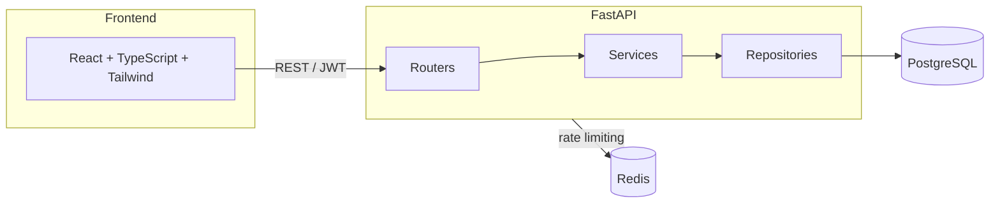

# Banking Application

A full-stack banking app built to demonstrate the parts of backend engineering that actually matter in a financial system: atomic money transfers under concurrency, JWT auth with 2FA, role-based access, and an immutable audit trail — not just CRUD.

> **Note:** This uses fake/mock balances only. No real payment rails or real money are involved anywhere in this project.

## Why this exists

Most portfolio CRUD apps don't have to prove correctness under concurrent writes or defend against IDOR. This one does:

- **Money is never a float.** Balances and amounts are stored and transmitted as integer cents (`BigInteger`), converted to dollars only for display.
- **Transfers are atomic and deadlock-safe.** A transfer locks both accounts (`SELECT ... FOR UPDATE`) in a fixed, sorted order so two concurrent opposite-direction transfers between the same pair of accounts can never deadlock, and a failure anywhere rolls back the whole operation — no money is ever created or destroyed. See [`backend/app/services/transaction_service.py`](backend/app/services/transaction_service.py).
- **IDOR is tested, not assumed.** Every account/transaction lookup is scoped to the requesting user; there's an explicit test asserting user A gets a 404 (not a 403 — no existence leak) when probing user B's account by ID. See [`backend/tests/test_accounts.py`](backend/tests/test_accounts.py).
- **Every money movement is audited.** An insert-only `audit_logs` table records every deposit, withdrawal, transfer, login, and 2FA change — no update/delete endpoint for it exists anywhere in the API.

## Architecture



Backend follows a strict **Router → Service → Repository → Model** layering: routers only parse/validate input, services hold business rules (including all locking logic), repositories are the only layer touching the DB session.

## Tech stack

| Layer | Choice |
|---|---|
| Backend | FastAPI, SQLAlchemy 2.0 (async), Alembic |
| Database | PostgreSQL (money as integer cents, never float) |
| Cache / rate limiting | Redis via `slowapi` |
| Auth | JWT access + refresh tokens, `argon2` password hashing, TOTP 2FA (`pyotp`) |
| Frontend | React, TypeScript, Tailwind CSS, Vite |
| Testing | pytest + pytest-asyncio + httpx (37 tests, incl. a real DB-level concurrency test) |
| Infra | Docker Compose, GitHub Actions CI |
| Scheduling | APScheduler (in-process background job, no extra infra) |

## Features

**Phase 1 (MVP):**
- Registration & login with JWT access + refresh tokens (refresh tokens are hashed at rest and rotated on every use)
- TOTP-based 2FA (QR provisioning + verification), rate-limited login/register endpoints
- Role-based access control (customer / admin)
- Multiple account types (checking / savings) per user
- Deposit, withdraw, transfer — all atomic, all row-locked
- Paginated, filterable transaction history (by type, date range, amount range)
- Immutable audit log of every security- and money-relevant action

**Phase 2, shipped so far — Beneficiaries + scheduled/recurring transfers:**
- Save a beneficiary by account number (`GET /accounts/lookup` resolves a number to an id without ever exposing the owner or balance)
- Schedule a transfer (once / daily / weekly / monthly) from any account's Transfer page; a background job (APScheduler, polling every 60s) executes due transfers by calling the exact same row-locked `TransactionService.transfer()` manual transfers use — no separate, unaudited money-movement path
- Failed runs (e.g. insufficient funds) back off 1 hour and retry automatically rather than silently dropping the schedule
- **Known limitation:** on Render's free tier the backend spins down after 15 min idle, so the scheduler pauses with it — a due recurring transfer fires late (on the next request that wakes the service), not exactly on schedule

**Still to come (Phase 2):** loan requests + EMI calculator, spending analytics dashboard, email notifications, and live deployment verification.

## Running locally

### Option A — Docker Compose (closest to production)

```bash
docker compose up --build
```

This starts Postgres, Redis, the backend (migrations run automatically on boot), and the frontend.

- Frontend: http://localhost:5173
- Backend API: http://localhost:8000
- Interactive API docs (Swagger): http://localhost:8000/docs

Seed demo data (in a second terminal, once the backend container is up):

```bash
docker compose exec backend python -m scripts.seed
```

Demo logins:

| Role | Email | Password |
|---|---|---|
| Customer | `demo.customer@example.com` | `DemoPass123!` |
| Admin | `demo.admin@example.com` | `DemoPass123!` |

### Option B — Local dev loop (faster iteration)

Backend:

```bash
cd backend
python -m venv venv && source venv/bin/activate
pip install -r requirements.txt
cp .env.example .env   # then edit DATABASE_URL/REDIS_URL if needed
alembic upgrade head
python -m scripts.seed
uvicorn app.main:app --reload
```

Requires a local Postgres and Redis (or run just those two via `docker compose up postgres redis`).

Frontend:

```bash
cd frontend
cp .env.example .env
npm install
npm run dev
```

### Running tests

```bash
cd backend
# tests run against TEST_DATABASE_URL — a second database, e.g. `banking_test`
alembic upgrade head  # (with TEST_DATABASE_URL set, or run against both DBs)
pytest -v
```

The suite includes `test_concurrent_withdrawals_never_overdraw_the_account`, which fires two simultaneous withdrawals at one account where only one can be satisfied by the balance, and asserts exactly one succeeds and the balance never goes negative — this is the test that actually exercises the row-locking guarantee, not just the happy path.

## Deploying to production

Backend + Postgres + Redis on **Render** (free tier), frontend on **Vercel** (free tier).

### Backend (Render)

1. Sign up at [render.com](https://render.com) (GitHub OAuth is fastest).
2. **New +** → **Blueprint** → connect the `Banking_Application` GitHub repo. Render reads [`render.yaml`](render.yaml) at the repo root and proposes three resources: `banking-db` (Postgres), `banking-redis` (Key Value / Redis-compatible), `banking-backend` (the Dockerized API). Click **Apply**.
3. Wait for the Docker build + first deploy (a few minutes). The container runs `alembic upgrade head` on every boot before starting uvicorn, so the schema is created automatically — no manual migration step.
4. Once live, copy the backend's public URL (`https://banking-backend-xxxx.onrender.com`) and confirm `/health` returns `{"status":"ok"}`.
5. Seed demo data: open the **Shell** tab on the `banking-backend` service in the Render dashboard and run `python -m scripts.seed`.

**Free-tier caveats:** the web service spins down after 15 min idle (~1 min cold start on the next request); the free Postgres database expires 30 days after creation (14-day grace period after that) and will need recreating or upgrading.

### Frontend (Vercel)

1. Sign up at [vercel.com](https://vercel.com) (GitHub OAuth).
2. **Add New** → **Project** → import the same repo, set **Root Directory** to `frontend`.
3. Add an environment variable `VITE_API_BASE_URL` = `https://<your-render-backend-url>/api/v1`, then deploy. (`vercel.json` in `frontend/` handles SPA routing so direct links like `/dashboard` don't 404.)
4. Copy the resulting Vercel URL.

### Wire them together

Back on Render, open `banking-backend` → **Environment**, set `CORS_ORIGINS` to `["https://<your-vercel-url>"]`, and save (triggers a redeploy). Without this step the frontend's requests will be blocked by CORS.

## API docs

Once the backend is running, full interactive OpenAPI/Swagger docs are at `/docs` (and ReDoc at `/redoc`).

## CI

GitHub Actions (`.github/workflows/ci.yml`) runs on every push/PR: spins up Postgres + Redis, runs Alembic migrations and the full pytest suite for the backend, and runs `tsc --noEmit` + `vite build` for the frontend.
